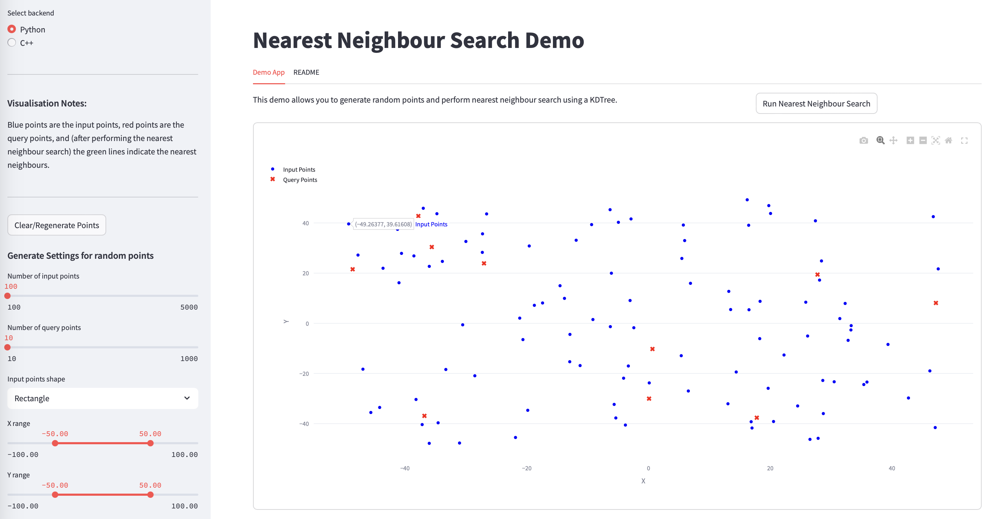

**`nearest-neighbour-cg`**

# Implementations of nearest neighbour calculations for Computational Geometry (CG): A demonstration.

## Status

*This project is in an experimental stage. It is not yet ready for production use and may contain bugs or incomplete features. Use at your own risk! In particular the Python wrappers for the C++ functions are in the process of being refactored and re-tested.*

______________________________________________________________________

- [Implementations of nearest neighbour calculations for Computational Geometry (CG): A demonstration.](#implementations-of-nearest-neighbour-calculations-for-computational-geometry-cg-a-demonstration)
  - [Status](#status)
  - [What is Computational Geometry and why does it matter?](#what-is-computational-geometry-and-why-does-it-matter)
  - [Applications of Computational Geometry](#applications-of-computational-geometry)
    - [Automated Embroidery](#automated-embroidery)
  - [Tools and C++ Libraries](#tools-and-c-libraries)
    - [C++ Libraries](#c-libraries)
    - [Python Libraries](#python-libraries)
  - [DEMO: Nearest Neighbour (NN) Problem](#demo-nearest-neighbour-nn-problem)
    - [Demo App and Backend Approach](#demo-app-and-backend-approach)
  - [References: Introductory CG and Nearest Neighbour Algorithms](#references-introductory-cg-and-nearest-neighbour-algorithms)

## What is Computational Geometry and why does it matter?

Computational geometry is a branch of computer science focused on designing and analysing algorithms to solve geometric problems involving points, lines, polygons, and other shapes, usually in two or three dimensions. It matters because many real-world applications-from computer graphics and robotics to geographic information systems (GIS) and computer-aided design (CAD)-rely on efficiently processing and querying geometric data.

## Applications of Computational Geometry

Typical industry use cases include:

- **Computer Graphics:** Rendering scenes, hidden surface removal, and illumination calculations.
- **Robotics:** Motion planning and obstacle avoidance.
- **GIS:** Spatial queries like location search, route planning, and map overlays.
- **CAD/CAM:** Designing and manufacturing parts with precise geometric constraints.
- **Computer Vision:** 3D reconstruction and object recognition.
- **Integrated Circuit Design:** Layout verification and mesh generation.
- **Automated embroidery:** Designing and stitching patterns on textiles.

### Automated Embroidery

Automated embroidery is a fascinating application of computational geometry, where algorithms are used to create intricate designs on fabric. This involves:

- **CAD/CAM**
  - **Stitch Path Optimisation**: Planning optimal needle paths to minimise thread breaks, jumps, and runtime (similar to TSP solvers in CG).
  - **Shape Decomposition**: Splitting complex embroidery designs into stitchable regions using polygon clipping, triangulation, or Voronoi diagrams.
  - **Collision Detection**: Preventing needle collisions with existing stitches or fabric folds using spatial indexing (e.g., KD-trees, AABB trees).
- **Computer Graphics**
  - **Stitch Rendering**: Simulating thread density, shading, and texture for realistic previews using rasterisation or procedural geometry.
  - **Pattern Generation**: Creating geometric motifs (e.g., floral, lace) via fractal algorithms or symmetry transformations.
- **Numerical Analysis**
  - **Fabric Deformation Modelling**: Adjusting stitch positions dynamically to account for material stretch using finite element analysis (FEA) or spring-mass models.
- **Robotics**
  - **Multi-Arm Coordination**: Synchronising embroidery machine arms to avoid mechanical interference during high-speed stitching.
- **Computer Vision**
  - **Design Digitisation**: Converting raster images to vectorised embroidery paths using contour tracing or skeletonisation.

**Why This Matters**

Embroidery requires millimeter precision to avoid costly material waste. Computational geometry enables:

- **Efficiency**: Reducing stitch count while maintaining design integrity.
- **Adaptability**: Auto-correcting designs for stretchy/fragile fabrics.
- **Innovation**: Supporting 3D embroidery or hybrid textile-electronics designs.

## Tools and C++ Libraries

In computational geometry, various libraries and tools are used to implement algorithms and solve geometric problems. Some popular ones include:

### C++ Libraries

- **CGAL**: The [Computational Geometry Algorithms Library](https://www.cgal.org) - A C++ library providing easy access to efficient and reliable geometric algorithms.
- **Boost.Geometry**: [Boost.Geometry](https://www.boost.org/doc/libs/release/libs/geometry/) - A C++ library for geometric algorithms and data structures.
- **GEOS**: [GEOS](https://libgeos.org/) - A C++ library that implements the Open Geospatial Consortium (OGC) Simple Features Specification for SQL.
- **Clipper**: [Clipper](http://www.angusj.com/delphi/clipper.php) - A C++ library for clipping and offsetting polygons.
- **OpenCV**: [OpenCV](https://opencv.org/) - A computer vision library that includes geometric transformations and image processing functions.
- **OpenGL**: [OpenGL](https://www.opengl.org) - A graphics library for rendering 2D and 3D vector graphics, often used in conjunction with computational geometry for visualisation.

### Python Libraries

- **Shapely**: [Shapely](https://shapely.readthedocs.io/) - A Python library for manipulation and analysis of planar geometric objects.

## DEMO: Nearest Neighbour (NN) Problem

We have selected the **nearest neighbour problem** as a "`Hello World`" style demonstration of computational geometry.

The **nearest neighbour problem**, finding the closest point(s) in a dataset to a given query point, is a fundamental example of computational geometry. It illustrates key concepts such as spatial data structures (like kd-trees), distance metrics, and efficient search algorithms. Nearest neighbour search is widely used in recommendation systems, clustering, pattern recognition, and many other fields where understanding proximity in geometric or feature space is essential.

By studying nearest neighbour algorithms, one gains insight into how computational geometry tackles the challenge of organising and querying spatial data efficiently, which is critical for performance in many applications.

### Demo App and Backend Approach

To bring the nearest neighbour problem to life, we have developed an interactive demonstration app (see below) that lets you generate random point sets, run nearest neighbour queries, and visualise the results.

The app is built with a modular backend, allowing you to compare and explore several industry-standard approaches to nearest neighbour search:

- **C++/CGAL Backend:** Uses the Computational Geometry Algorithms Library ([`CGAL`](https://www.cgal.org)) to build a robust kd-tree and perform exact nearest neighbour queries with high performance and reliability, serving as a reference implementation for computational geometry.
- **C++/nanoflann Backend:** Offers a lightweight, header-only kd-tree ([`nanoflann`](https://github.com/jlblancoc/nanoflann)) for fast, exact nearest neighbour search, ideal for large in-memory datasets and batch processing.
- **Python Backend:** Utilises [`scikit-learn`](https://scikit-learn.org)’s KDTree for easy prototyping and teaching, making it accessible for those new to computational geometry.
- **SQL/DuckDB Backend:** Demonstrates a less conventional approach, showing how modern analytics databases (e.g. [DuckDB](https://duckdb.org)) can solve geometric problems at scale using SQL and the VSS (Vector Similarity Search) extension. This enables fast, approximate nearest neighbour search to be performed directly within SQL queries. This backend highlights the power of SQL-based analytics for geometric problems, in contrast to traditional in-memory algorithms.

The app’s architecture is designed for clarity and extensibility:

- **Backend modules** encapsulate each algorithm and data structure, exposing a consistent interface for queries and benchmarking.
- **Frontend visualisation** (via [Streamlit](https://streamlit.io) allows users to interactively generate data, run searches, and compare results across backends.
- **Documentation and methods** (see [`README_methods.md`](docs/README_methods.md)) explain the theory and implementation details, helping you understand both the “how” and the “why” of each approach.

By providing multiple backends and a unified interface, this demo not only showcases the computational geometry foundations of the nearest neighbour problem, but also offers a practical comparison of algorithmic and data engineering strategies-from classic C++ libraries to modern SQL analytics.

## References: Introductory CG and Nearest Neighbour Algorithms

1. [Computational Geometry - Wikipedia](https://en.wikipedia.org/wiki/Computational_geometry)
1. [Lecture Notes on Computational Geometry - CMU](https://www.cs.cmu.edu/~15451-f22/lectures/lec21-geometry.pdf)
1. [Basics of Computational Geometry - CIMEC](https://cimec.org.ar/twiki/pub/Cimec/GeometriaComputacional/cg.basics.pdf)
1. [Introduction to Computational Geometry - YouTube](https://www.youtube.com/watch?v=qMgF8Fcrk_c)
1. [Introduction to Computational Geometry - UMD](https://www.cs.umd.edu/class/spring2020/cmsc754/Lects/lect01-intro.pdf)
1. [Importance of Algorithms in Computational Geometry - Longdom](https://www.longdom.org/open-access/importance-of-algorithms-in-computational-geometry-for-analyzing-geometrical-analysis-101640.html)
1. [Nearest Neighbor Lecture Notes - CMU](https://www.cs.cmu.edu/~15451-s19/lectures/lec22-nearest-neighbor.pdf)
1. [StudySmarter Explanation on Computational Geometry](https://www.studysmarter.co.uk/explanations/math/geometry/computational-geometry/)
1. [Research Discoveries in Computational Geometry - UT Dallas](https://cs.utdallas.edu/6717/dr-benjamin-raichel-and-researcher-two-important-discoveries-computational-geometry/)
1. [Nearest Neighbor Class Notes - CMU](https://www.cs.cmu.edu/afs/cs/academic/class/15456-s10/ClassNotes/nn.pdf)
1. [Nearest Neighbor Search - Wikipedia](https://en.wikipedia.org/wiki/Nearest_neighbor_search)
