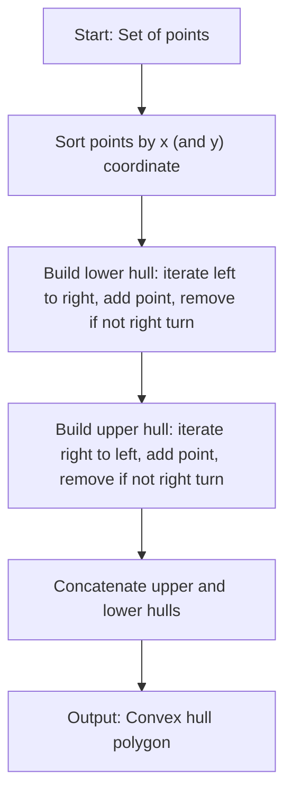
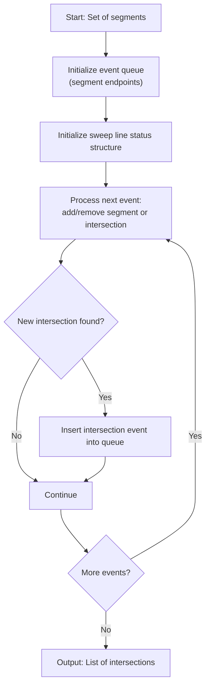
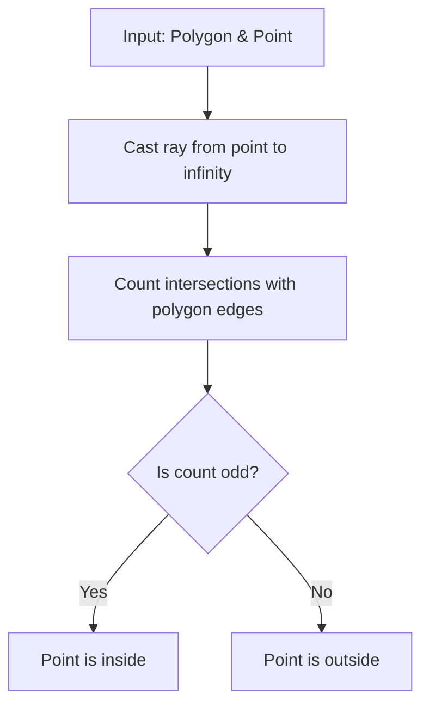
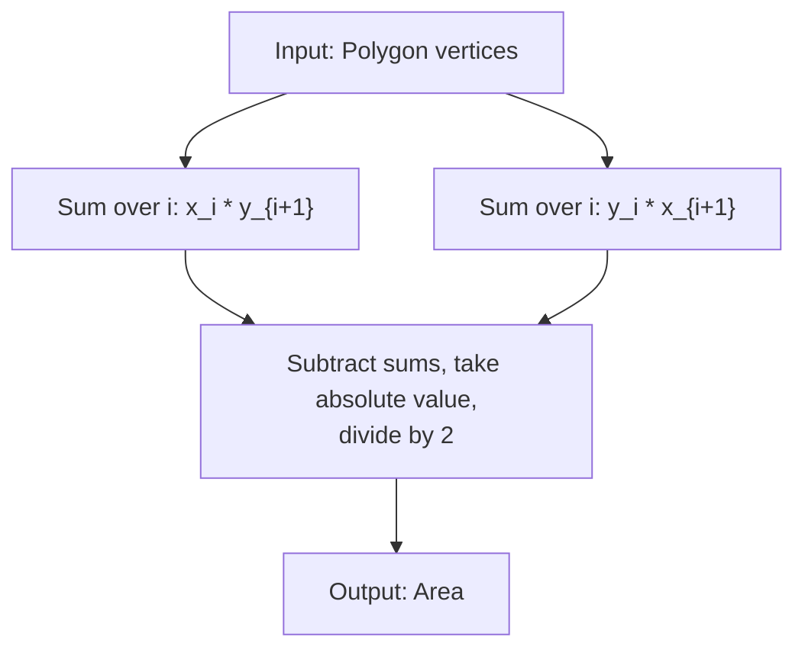
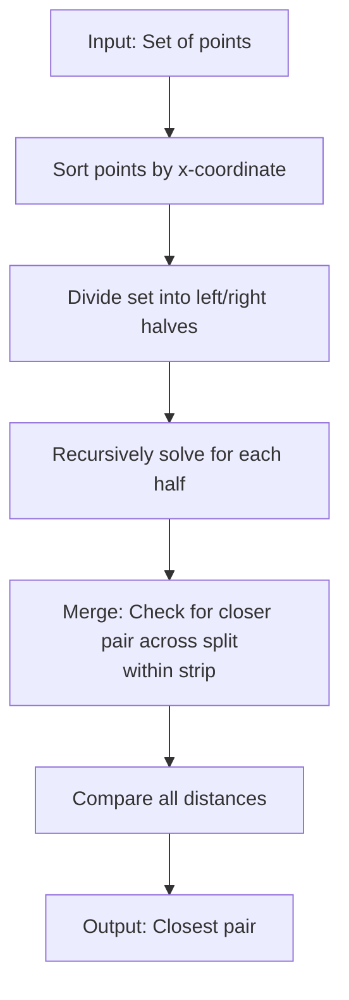
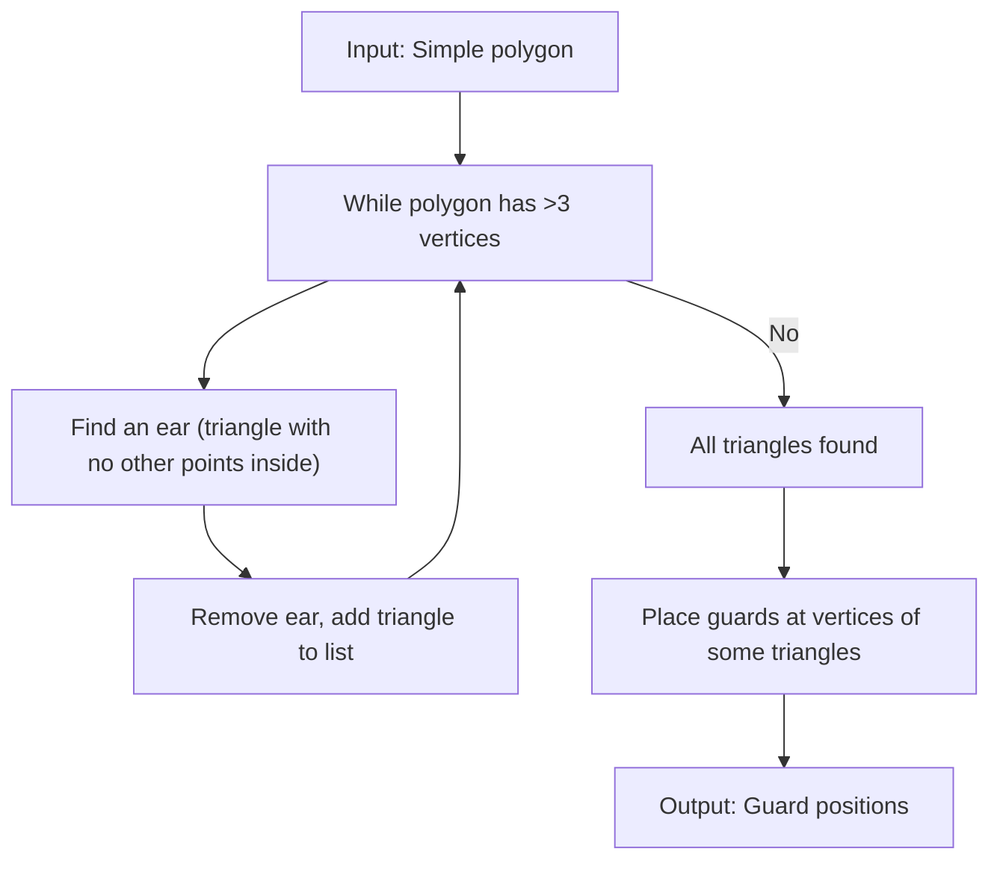
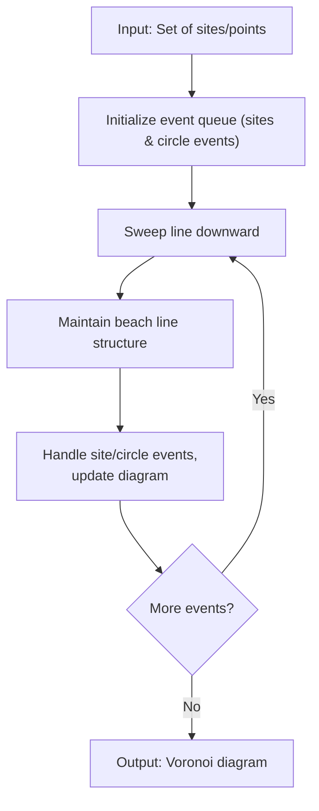
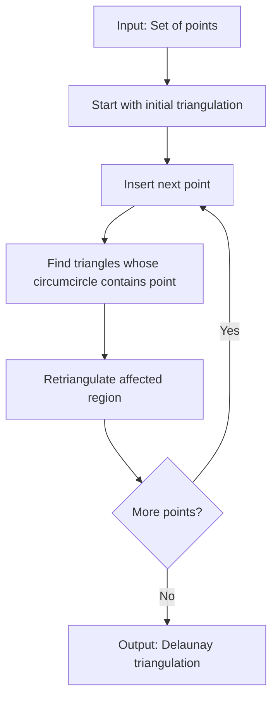

# Computational Geometry: Core Concepts, Classic Problems, and Algorithmic Foundations

Computational geometry is a field at the intersection of mathematics and computer science, focusing on the design and analysis of algorithms for geometric problems. It underpins applications in computer graphics, robotics, GIS, CAD, and more[^2][^5]. This document provides a concise, practical reference for the core concepts, classic “hello world” problems, and key algorithms—framed for someone with a strong mathematics and programming background.

---

## **1. What Is Computational Geometry?**

Computational geometry studies algorithms for solving geometric problems—often in two or three dimensions, but also in higher-dimensional spaces. The field’s classic problems include finding convex hulls, determining intersections, partitioning polygons, and answering proximity queries[^2][^5].

---

## **2. Key Definitions**

| Term | Definition |
| :-- | :-- |
| **Convex** | A set where, for any two points, the line segment between them is entirely within the set[^2]. |
| **Convex Hull** | The smallest convex set containing a given set of points (“rubber band” around the points)[^2]. |
| **Voronoi Diagram** | Partition of space into regions where each region contains all points closest to a given site[^2]. |
| **Delaunay Triangulation** | A triangulation where no point is inside the circumcircle of any triangle; dual to Voronoi[^2]. |
| **Triangulation** | Subdividing a polygon into triangles, often used for mesh generation and visibility[^2]. |
| **Intersection** | Determining if/where geometric objects (lines, segments, polygons) cross or overlap[^2]. |

---

## **3. Classic “Hello World” Problems**

These problems are foundational in computational geometry, each with well-established algorithms and practical significance[^2][^5][^4]:

| Problem | Description |
| :-- | :-- |
| **Convex Hull** | Compute the smallest convex polygon enclosing a set of points |
| **Line Segment Intersection** | Find intersections among a set of line segments |
| **Point in Polygon** | Test if a point lies inside, outside, or on a polygon |
| **Polygon Area** | Compute the area from the vertices of a polygon |
| **Closest Pair of Points** | Find the two closest points in a set |
| **Art Gallery (Triangulation)** | Triangulate a polygon, often for visibility/guard placement |
| **Voronoi/Delaunay** | Partition/triangulate space by proximity |

---

## **4. Key Algorithms and How They Work**

### **4.1 Convex Hull**

**Graham Scan / Andrew’s Monotone Chain:**

- Sort points by x (and y) coordinate.
- Build lower and upper hulls by iterating and checking orientation (using cross product).
- Remove points that would make a “right turn,” ensuring convexity.
- Time: $O(n \log n)$[^2][^5].

### **4.2 Line Segment Intersection**

**Sweep Line (Bentley–Ottmann):**

- Sweep a vertical line across the plane.
- Maintain an event queue (segment endpoints, intersections) and a status structure (active segments).
- At each event, update status and check for new intersections.
- Time: $O((n + k) \log n)$, where $k$ is the number of intersections[^2].

### **4.3 Point in Polygon**

**Ray Casting:**

- Cast a ray from the point to infinity.
- Count intersections with polygon edges.
- Odd count = inside; even = outside.

**Winding Number:**

- Track how many times the polygon “winds around” the point; nonzero = inside.

### **4.4 Polygon Area**

**Shoelace Formula:**

$$
A = \frac{1}{2} \left| \sum_{i=1}^{n} (x_i y_{i+1} - x_{i+1} y_i) \right|
$$

where $(x_{n+1}, y_{n+1}) = (x_1, y_1)$.

### **4.5 Closest Pair of Points**

**Divide and Conquer:**

- Sort points by x-coordinate.
- Recursively solve for left/right halves.
- Merge step checks for closer pairs across the dividing line.
- Time: $O(n \log n)$[^5].

### **4.6 Art Gallery (Polygon Triangulation)**

**Ear Clipping:**

- Iteratively remove “ears” (triangles with no other polygon points inside).
- Continue until only triangles remain.
- Place guards at vertices as needed.

### **4.7 Voronoi Diagram / Delaunay Triangulation**

**Fortune’s Algorithm (Voronoi):**

- Sweep line downward, maintaining a beach line and event queue.
- Update diagram at site and circle events.
- Time: $O(n \log n)$[^2].

**Incremental Insertion (Delaunay):**

- Add points one by one, retriangulating affected regions to maintain Delaunay property.

---

## **5. Visual Algorithm Flows (Mermaid Diagrams)**

### **Convex Hull (Graham Scan / Monotone Chain)**

### **Line Segment Intersection (Sweep Line)**

### **Point in Polygon (Ray Casting)**

### **Polygon Area (Shoelace Formula)**

### **Closest Pair of Points (Divide \& Conquer)**

### **Art Gallery (Ear Clipping Triangulation)**

### **Voronoi Diagram (Fortune's Algorithm)**

### **Delaunay Triangulation (Incremental Insertion)**

---

## **6. Connecting to Mathematical and Programming Experience**

- **Algorithmic Modelling:** Many computational geometry problems are direct applications of mathematical modelling and algorithmic thinking, skills you’ve developed in quantitative analytics and optimisation.
- **Proof and Rigor:** The correctness and complexity analysis of geometric algorithms rely on mathematical reasoning—your background in pure mathematics and computational science is directly relevant.
- **Programming:** Implementing these algorithms efficiently, especially in languages like C++ or Python, draws on your experience with data structures, numerical methods, and software engineering best practices.

---

## **7. Further Reading and Resources**

- [CMSC 754 Computational Geometry Lecture Notes][^2]
- [Computational Geometry (de Berg et al.)][^5]
- [Toptal: Computational Geometry in Python][^4]
- [YouTube: Brief Introduction to Computational Geometry][^3]
- [YouTube: CSES Geometry Problem Set][^6]

---

## References

[^1]: https://www.youtube.com/watch?v=plCO3gOnli8  

[^2]: https://www.cs.cmu.edu/afs/cs/academic/class/15456-f15/Handouts/cmsc754-lects.pdf  

[^3]: https://www.youtube.com/watch?v=qMgF8Fcrk_c  

[^4]: https://www.toptal.com/python/computational-geometry-in-python-from-theory-to-implementation  

[^5]: http://www.cs.cmu.edu/afs/cs/academic/class/15456-f15/Handouts/BKOS.pdf  

[^6]: https://www.youtube.com/watch?v=G9QTjWtK_TQ  

[^7]: https://www.slideshare.net/slideshow/a-tutorial-on-computational-geometry/348786  

[^8]: https://www.cs.kent.edu/~dragan/CG/CG-Book.pdf  

